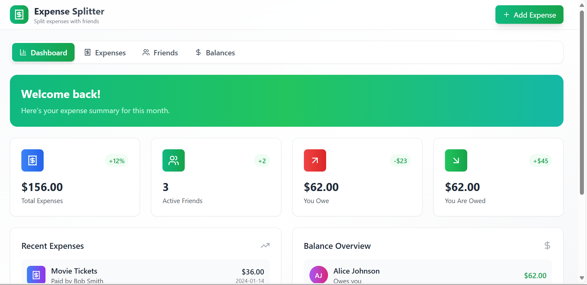
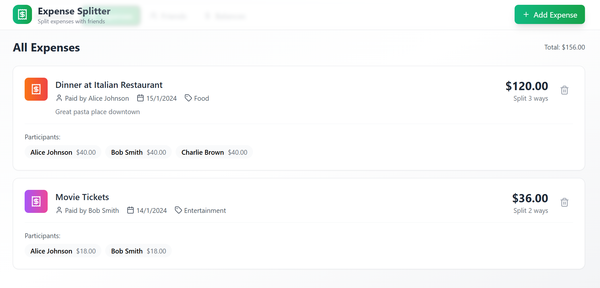

# Expense Splitter 🧾

A full-stack expense management app inspired by Splitwise. It enables users to split group expenses, view individual balances, and simplify settlements — all with a clean, mobile-responsive, and real-time interface.

> 🟢 **Live Demo**: [https://expense-splitter-git-main-ujjwal-2027s-projects.vercel.app/](https://expense-splitter-git-main-ujjwal-2027s-projects.vercel.app/)

---

## 🧩 Tech Stack

- **Frontend**: React.js, Vite, TypeScript, Tailwind CSS  
- **State Management**: React Context API  
- **Backend**: Supabase (Auth, Realtime, PostgreSQL)  
- **API**: Custom REST API  
- **Charts & Analytics**: Recharts  
- **Hosting**: Vercel

---

## ✨ Features

- 🔐 Authentication via Supabase (email/password)
- 📡 Real-time expense syncing with Supabase Realtime
- 👥 Group-based expense management
- 🧮 Smart split logic: equal and custom splits
- 📊 Visual insights using Recharts (bar & pie charts)
- 📱 Mobile-responsive and intuitive UI
- 📚 Modular codebase using Context API and reusable components

---

## 📸 Screenshots

### 🏠 Dashboard View

### ➕ Adding a New Expense

### 📊 Expenses Analytics

---

## 📦 Future Improvements
✅ Expense settlement button (mark as paid)

✅ Notifications for group activity

✅ Friend system or member search

✅ Export to CSV or PDF

✅ Advanced filters and recurring expense support

